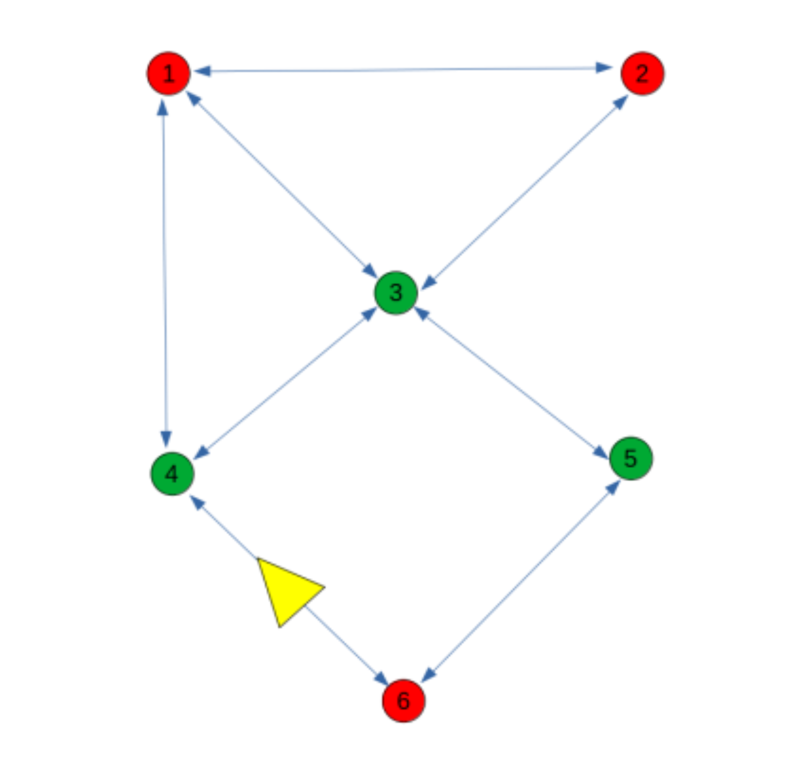
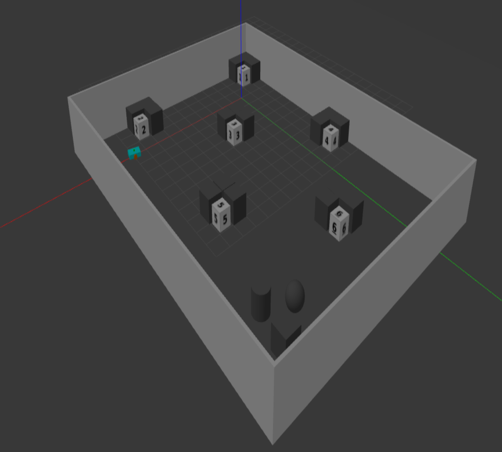
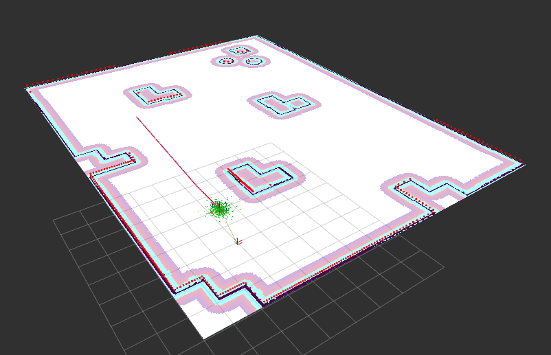
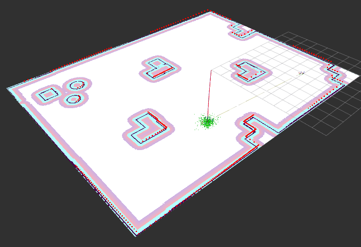

# Waypoint Navigation Demo 🎮



This repository demonstrates the complete setup for waypoint navigation using QuestBot in a ROS2 environment. The demo involves loading the robot model, localizing it, and navigating it through a set of waypoints.

## Repository Structure
This repo includes several submodules required for the demo. You can click on each link to view the description or README of that specific package:

- [questbot_description](https://github.com/manojm-dev/questbot_description.git): Contains the robot's URDF and description files.
- [gazebo_bringup](https://github.com/manojm-dev/gazebo_bringup.git): Brings up the Gazebo simulation.
- [localization_bringup](https://github.com/manojm-dev/localization_bringup.git): Handles robot localization.
- [navigation_bringup](https://github.com/manojm-dev/navigation_bringup.git): Handles navigation functionality.
- [waypoint_tools](https://github.com/manojm-dev/waypoint_tools.git):  This package is used to interactively record waypoints based on the robot's odometry and save them to a JSON file.
- [waypoint_navigation](https://github.com/manojm-dev/waypoint_navigation.git): This package does planning and navigation to the goal waypoint throught shortest path.

## Links
- questbot_description  - [README](https://github.com/manojm-dev/questbot_description/blob/main/README.md)
- gazebo_bringup        - [README](https://github.com/manojm-dev/gazebo_bringup/blob/main/README.md)
- localization_bringup  - [README](https://github.com/manojm-dev/localization_bringup/blob/main/README.md)
- navigation_bringup    - [README](https://github.com/manojm-dev/navigation_bringup/blob/main/README.md)
- waypoint_tools        - [README](https://github.com/manojm-dev/waypoint_tools/blob/main/README.md) | [Demo Video](https://drive.google.com/file/d/1KklIigYbCunJCCx7AhKZNd6-13tMK6ji/view?usp=sharing)
- waypoint_navigation   - [README](https://github.com/manojm-dev/waypoint_navigation/blob/main/README.md) | [Demo Video](https://drive.google.com/file/d/1bQ8AxHoTOHwkVaLGyLWngporGGeXUoO3/view?usp=sharing) 


## 🧑‍💻 Demo Setup

1. 📂 Clone the repository with submodules
```
mkdir -p ~/waypoint_nav_demo/src
cd ~/waypoint_nav_demo/src
git clone --recurse-submodules https://github.com/manojm-dev/waypoint_navigation_demo.git
```

2) 📦 Install dependencies
```
cd ~/waypoint_nav_demo
sudo apt-get update -y && rosdep update && rosdep install --from-paths src --ignore-src -y
```

3) 🛠️ Building the packages
```
cd ~/waypoint_nav_demo
colcon build
```

## 🎮 Running the Demo

1. 🏙️ Launch Gazebo Simulation

    - Run this cmd to launch the gazebo simulation environment and spawing the robot in it.
    ```
    ros2 launch gazebo_bringup simulation.launch.py
    ```
    


2. 🧭 Launch Navigation

    - Running this cmd  will activate the nav2 navigation stack with static map, enabling it to plan paths and move around the environment.
    > [!Note] 
    > Don't forget to localize the robot in RViz and set a goal near waypoint 4, as per the task description in task the robot need to be near waypoint 4.
    ```
    ros2 launch navigation_bringup navigation.launch.py
    ```
    


3. 🎯 Running waypoint navigtor 

    Finally, to navigate to a specific waypoint:  
    - Waypoints are mapped as follows:
        - (1, A), (2, B), (3, C), (4, D), (5, E), (6, F)
    To navigate to waypoint B (as per description given in task)

    ```
    ros2 run waypoint_navigation waypoint_navigator --ros-args -p waypoint_goal:="B"
    ```
    

## 🎉 Conclusion

- This demo showcases the full process of setting up and running Waypoint Navigation. The steps include launching the simulation, configuring the navigation stack, and performing waypoint-based navigation.

- Thank you for reviewing this demo! Feel free to ask any questions or request clarification on any part of the demo. I'm happy to dive deeper into any aspects you'd like to discuss. 😊
